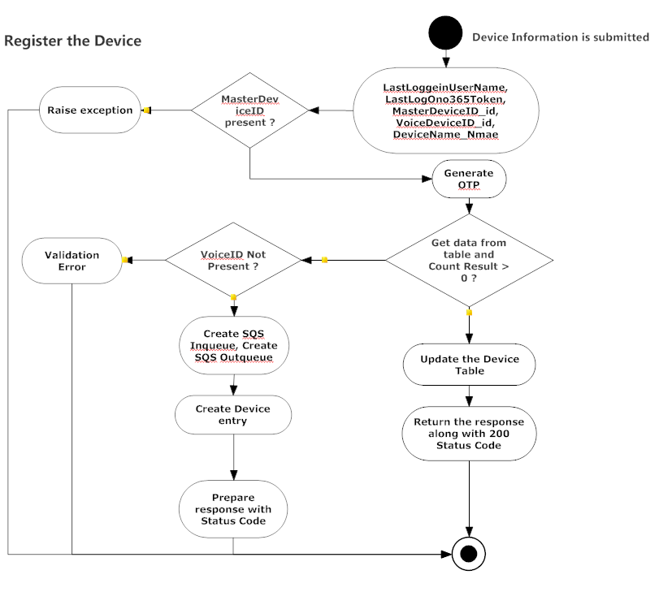
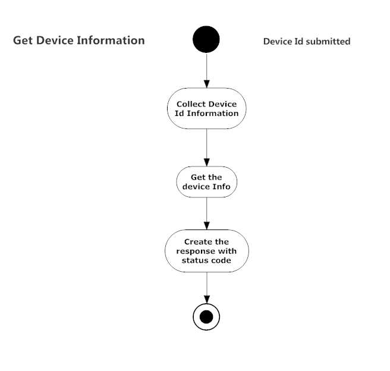
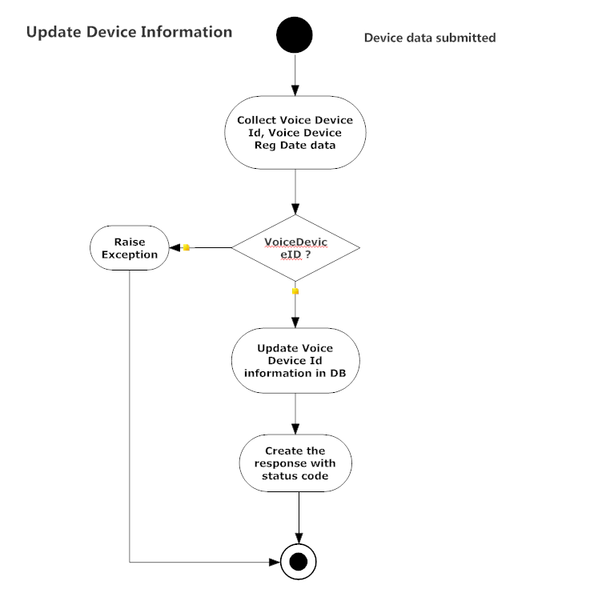
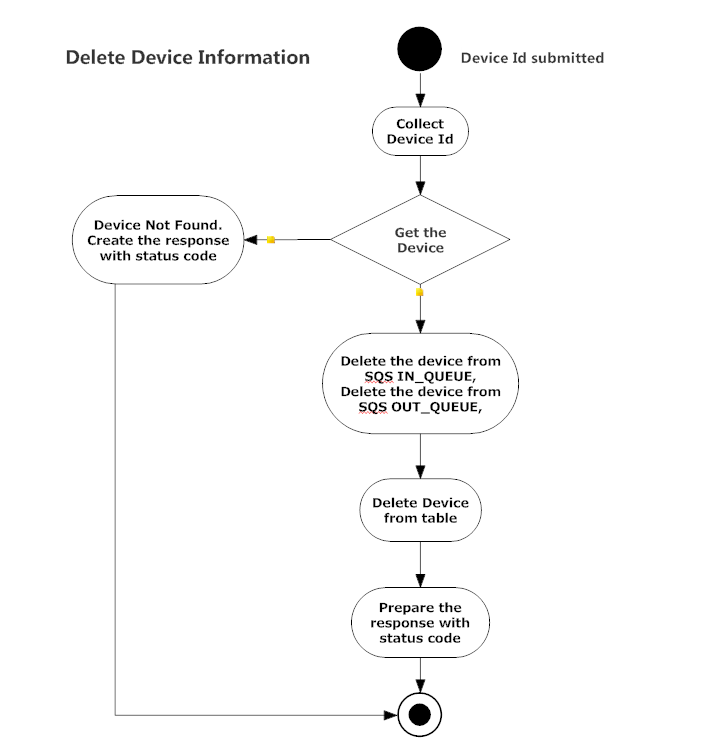
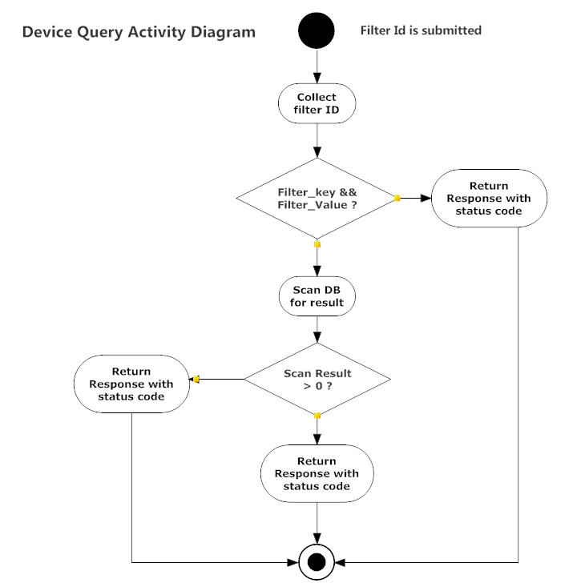

- [Table of contents](#table-of-contents)
- [Schema for Device Information table](#schema-for-device-information-table)
- [CURL samples](#curl-samples)
	- [DeviceInformation Create](#deviceinformation-create)
	- [DeviceInformation Get](#deviceinformation-get)
	- [DeviceInformation PUT](#deviceinformation-put)
	- [DeviceInformation Delete](#deviceinformation-delete)
	- [DeviceInformation Query](#deviceinformation-query)
- [Activity Diagrams](#activity-diagrams)
	- [DeviceInformation Create](#deviceinformation-create-1)
	- [DeviceInformation Get](#deviceinformation-get-1)
	- [DeviceInformation PUT](#deviceinformation-put-1)
	- [DeviceInformation Delete](#deviceinformation-delete-1)
	- [DeviceInformation Query](#deviceinformation-query-1)
- [Code Samples for C Sharp](#code-samples-for-c-sharp)
	- [DeviceInformation Create](#deviceinformation-create-2)
	- [DeviceInformation Get](#deviceinformation-get-2)
	- [DeviceInformation PUT](#deviceinformation-put-2)
	- [DeviceInformation Delete](#deviceinformation-delete-2)
	- [DeviceInformation Query](#deviceinformation-query-2)
- [Code Samples for Node JS](#code-samples-for-node-js)
	- [DeviceInformation Create](#deviceinformation-create-3)
	- [DeviceInformation Get](#deviceinformation-get-3)
	- [DeviceInformation PUT](#deviceinformation-put-3)
	- [DeviceInformation Delete](#deviceinformation-delete-3)
	- [DeviceInformation Query](#deviceinformation-query-3)
- [Code Samples for JavaScript](#code-samples-for-javascript)
	- [DeviceInformation Create](#deviceinformation-create-4)
	- [DeviceInformation Get](#deviceinformation-get-4)
	- [DeviceInformation PUT](#deviceinformation-put-4)
	- [DeviceInformation Delete](#deviceinformation-delete-4)
	- [DeviceInformation Query](#deviceinformation-query-4)

Schema for Device Information table
--------------

|       id       |    {GUID}     |
| :------------: | :-----------: |
|  ActiveDirID   |      111      |
|     CardID     |    AWS123     |
|     Domain     |    domain     |
|     Email      | test@test.com |
| LastDeviceUsed | str(datetime) |
|   LastLogin    | str(datetime) |
|      Name      |     Name      |
|     O365ID     |      xyx      |
|   O365Token    |    abcxyx     |

CURL samples
--------------
DeviceInformation Create
--------------
```curl
curl -X "POST" "https://XXXXXXXXXXXXXXXXXXXX.amazonaws.com/qa/api/v1/userprofile?one=1&two=2" \
     -H "x-api-key: XXXXXXXXXXXXXXXXXXXX" \
     -H "Content-Type: application/json" \
     -d $'{
  "CardID": "1239",
  "Domain": "SSDI",
  "O365ID": "kravikiran@onmicrosoft.com",
  "O365Token": "ABCDEFGHh",
  "Name": "Ravikian",
  "Email": "kravikiran@ssdi.sharp.co.in",
  "ActiveDirID": "ssdiblr"
}'

```

DeviceInformation Get
--------------
```curl
curl "https://XXXXXXXXXXXXXXXXXXXX.amazonaws.com/qa/api/v1/userprofile/%7Bid%7D?one=1&two=2" \
     -H "x-api-key: XXXXXXXXXXXXXXXXXXXX" \
     -H "Content-Type: application/json" \
     -d $'{}'
```

DeviceInformation PUT
--------------
```curl
curl -X "PUT" "https://64bg0rty5h.execute-api.us-east-1.amazonaws.com/qa/api/v1/userprofile/%7Bid%7D" \
     -H "x-api-key: NmvoWKXKzn70sOpQhqRPo58sR9fAedyD5RpjBJeX" \
     -H "Content-Type: application/json" \
     -d $'{
  "O365ID": "Ravi",
  "O365Token": "RaviTokeb"
}'

```
DeviceInformation Delete
--------------
```curl
curl -X "DELETE" "https://XXXXXXXXXXXXXXXXXXXX.amazonaws.com/qa/api/v1/userprofile/%7Bid%7D?one=1&two=2" \
     -H "x-api-key: XXXXXXXXXXXXXXXXXXXX" \
     -H "Content-Type: application/json" \
     -d $'{}'
```
DeviceInformation Query
--------------
```curl
curl -X "POST" "https://XXXXXXXXXXXXXXXXXXXX.amazonaws.com/qa/api/v1/userprofile/query" \
     -H "x-api-key: XXXXXXXXXXXXXXXXXXXX" \
     -H "Content-Type: application/json" \
     -d $'{
  "id": "CardID",
  "value": "12391"
}'
```
Activity Diagrams
--------------
DeviceInformation Create
--------------


DeviceInformation Get
--------------


DeviceInformation PUT
--------------


DeviceInformation Delete
--------------


DeviceInformation Query
--------------



Code Samples for C Sharp
--------------
DeviceInformation Create
--------------
```C#
using System;
using System.Threading.Tasks;
using System.Net;
using System.IO;
using System.Text;

namespace MyNamespace {
	public class MyActivity {
		
		private async Task<bool> UserProfileCreate () {

			string url = "https://XXXXXXXXXXXXXXXXXXXX.amazonaws.com/qa/api/v1/userprofile?one=1&two=2";

			HttpWebRequest request = (HttpWebRequest)WebRequest.Create (new Uri(url));
			request.ContentType = "application/json";
			request.Headers.Add("x-api-key", "XXXXXXXXXXXXXXXXXXXX");
			
			request.Method = "POST";
			
			string postData = "{\"Name\":\"Ravikian\",\"CardID\":\"1239\",\"Domain\":\"SSDI\",\"ActiveDirID\":\"ssdiblr\",\"Email\":\"kravikiran@ssdi.sharp.co.in\",\"O365ID\":\"kravikiran@onmicrosoft.com\",\"O365Token\":\"ABCDEFGHh\"}";
			ASCIIEncoding encoding = new ASCIIEncoding ();
			byte[] byte1 = encoding.GetBytes (postData);
			request.ContentLength = byte1.Length;
			Stream newStream = request.GetRequestStream ();
			newStream.Write (byte1, 0, byte1.Length);
			newStream.Close ();
			
			using (WebResponse response = await request.GetResponseAsync ()) {
				using (Stream stream = response.GetResponseStream ()) {
					return true;
					//process the response
				}
			}
		}
	}
}

```
DeviceInformation Get
--------------

```C#
using System;
using System.Threading.Tasks;
using System.Net;
using System.IO;
using System.Text;

namespace MyNamespace {
	public class MyActivity {
		
		private async Task<bool> UserProfileGet () {

			string url = "https://XXXXXXXXXXXXXXXXXXXX.amazonaws.com/qa/api/v1/userprofile/%7Bid%7D?one=1&two=2";

			HttpWebRequest request = (HttpWebRequest)WebRequest.Create (new Uri(url));
			request.ContentType = "application/json";
			request.Headers.Add("x-api-key", "XXXXXXXXXXXXXXXXXXXX");
			
			request.Method = "GET";
			
			string postData = "{}";
			ASCIIEncoding encoding = new ASCIIEncoding ();
			byte[] byte1 = encoding.GetBytes (postData);
			request.ContentLength = byte1.Length;
			Stream newStream = request.GetRequestStream ();
			newStream.Write (byte1, 0, byte1.Length);
			newStream.Close ();
			
			using (WebResponse response = await request.GetResponseAsync ()) {
				using (Stream stream = response.GetResponseStream ()) {
					return true;
					//process the response
				}
			}
		}
	}
}

```
DeviceInformation PUT
--------------

```C#
using System;
using System.Threading.Tasks;
using System.Net;
using System.IO;
using System.Text;

namespace MyNamespace {
	public class MyActivity {
		
		private async Task<bool> UserProfilePUT () {

			string url = "https://XXXXXXXXXXXXXXXXXXXX.amazonaws.com/qa/api/v1/userprofile/%7Bid%7D?one=1&two=2";

			HttpWebRequest request = (HttpWebRequest)WebRequest.Create (new Uri(url));
			request.ContentType = "application/json";
			request.Headers.Add("x-api-key", "XXXXXXXXXXXXXXXXXXXX");
			
			request.Method = "PUT";
			
			string postData = "{\"O365ID\":\"Ravi\",\"O365Token\":\"RaviTokeb\"}";
			ASCIIEncoding encoding = new ASCIIEncoding ();
			byte[] byte1 = encoding.GetBytes (postData);
			request.ContentLength = byte1.Length;
			Stream newStream = request.GetRequestStream ();
			newStream.Write (byte1, 0, byte1.Length);
			newStream.Close ();
			
			using (WebResponse response = await request.GetResponseAsync ()) {
				using (Stream stream = response.GetResponseStream ()) {
					return true;
					//process the response
				}
			}
		}
	}
}

```

DeviceInformation Delete
--------------

```C#
using System;
using System.Threading.Tasks;
using System.Net;
using System.IO;
using System.Text;

namespace MyNamespace {
	public class MyActivity {
		
		private async Task<bool> UserProfileDelete () {

			string url = "https://XXXXXXXXXXXXXXXXXXXX.amazonaws.com/qa/api/v1/userprofile/%7Bid%7D?one=1&two=2";

			HttpWebRequest request = (HttpWebRequest)WebRequest.Create (new Uri(url));
			request.ContentType = "application/json";
			request.Headers.Add("x-api-key", "XXXXXXXXXXXXXXXXXXXX");
			
			request.Method = "DELETE";
			
			string postData = "{}";
			ASCIIEncoding encoding = new ASCIIEncoding ();
			byte[] byte1 = encoding.GetBytes (postData);
			request.ContentLength = byte1.Length;
			Stream newStream = request.GetRequestStream ();
			newStream.Write (byte1, 0, byte1.Length);
			newStream.Close ();
			
			using (WebResponse response = await request.GetResponseAsync ()) {
				using (Stream stream = response.GetResponseStream ()) {
					return true;
					//process the response
				}
			}
		}
	}
}

```

DeviceInformation Query
--------------

```C#
using System;
using System.Threading.Tasks;
using System.Net;
using System.IO;
using System.Text;

namespace MyNamespace {
	public class MyActivity {
		
		private async Task<bool> UserProfileQuery () {

			string url = "https://XXXXXXXXXXXXXXXXXXXX.amazonaws.com/qa/api/v1/userprofile/query";

			HttpWebRequest request = (HttpWebRequest)WebRequest.Create (new Uri(url));
			request.ContentType = "application/json";
			request.Headers.Add("x-api-key", "XXXXXXXXXXXXXXXXXXXX");
			
			request.Method = "POST";
			
			string postData = "{\"id\":\"CardID\",\"value\":\"12391\"}";
			ASCIIEncoding encoding = new ASCIIEncoding ();
			byte[] byte1 = encoding.GetBytes (postData);
			request.ContentLength = byte1.Length;
			Stream newStream = request.GetRequestStream ();
			newStream.Write (byte1, 0, byte1.Length);
			newStream.Close ();
			
			using (WebResponse response = await request.GetResponseAsync ()) {
				using (Stream stream = response.GetResponseStream ()) {
					return true;
					//process the response
				}
			}
		}
	}
}
	
```

Code Samples for Node JS
--------------
DeviceInformation Create
--------------
```javascript
// request UserProfile Create 
(function(callback) {
    'use strict';
        
    const httpTransport = require('https');
    const responseEncoding = 'utf8';
    const httpOptions = {
        hostname: 'XXXXXXXXXXXXXXXXXXXX.amazonaws.com',
        port: '443',
        path: '/qa/api/v1/userprofile?one=1&two=2',
        method: 'POST',
        headers: {"x-api-key":"XXXXXXXXXXXXXXXXXXXX","Content-Type":"application/json"}
    };
    httpOptions.headers['User-Agent'] = 'node ' + process.version;
 
    // Paw Store Cookies option is not supported

    const request = httpTransport.request(httpOptions, (res) => {
        let responseBufs = [];
        let responseStr = '';
        
        res.on('data', (chunk) => {
            if (Buffer.isBuffer(chunk)) {
                responseBufs.push(chunk);
            }
            else {
                responseStr = responseStr + chunk;            
            }
        }).on('end', () => {
            responseStr = responseBufs.length > 0 ? 
                Buffer.concat(responseBufs).toString(responseEncoding) : responseStr;
            
            callback(null, res.statusCode, res.headers, responseStr);
        });
        
    })
    .setTimeout(0)
    .on('error', (error) => {
        callback(error);
    });
    request.write("{\"Name\":\"Ravikian\",\"CardID\":\"1239\",\"Domain\":\"SSDI\",\"ActiveDirID\":\"ssdiblr\",\"Email\":\"kravikiran@ssdi.sharp.co.in\",\"O365ID\":\"kravikiran@onmicrosoft.com\",\"O365Token\":\"ABCDEFGHh\"}")
    request.end();
    

})((error, statusCode, headers, body) => {
    console.log('ERROR:', error); 
    console.log('STATUS:', statusCode);
    console.log('HEADERS:', JSON.stringify(headers));
    console.log('BODY:', body);
});


```

DeviceInformation Get
--------------
```javascript
// request UserProfile Get 
(function(callback) {
    'use strict';
        
    const httpTransport = require('https');
    const responseEncoding = 'utf8';
    const httpOptions = {
        hostname: 'XXXXXXXXXXXXXXXXXXXX.amazonaws.com',
        port: '443',
        path: '/qa/api/v1/userprofile/%7Bid%7D?one=1&two=2',
        method: 'GET',
        headers: {"x-api-key":"XXXXXXXXXXXXXXXXXXXX","Content-Type":"application/json"}
    };
    httpOptions.headers['User-Agent'] = 'node ' + process.version;
 
    // Paw Store Cookies option is not supported

    const request = httpTransport.request(httpOptions, (res) => {
        let responseBufs = [];
        let responseStr = '';
        
        res.on('data', (chunk) => {
            if (Buffer.isBuffer(chunk)) {
                responseBufs.push(chunk);
            }
            else {
                responseStr = responseStr + chunk;            
            }
        }).on('end', () => {
            responseStr = responseBufs.length > 0 ? 
                Buffer.concat(responseBufs).toString(responseEncoding) : responseStr;
            
            callback(null, res.statusCode, res.headers, responseStr);
        });
        
    })
    .setTimeout(0)
    .on('error', (error) => {
        callback(error);
    });
    request.write("{}")
    request.end();
    

})((error, statusCode, headers, body) => {
    console.log('ERROR:', error); 
    console.log('STATUS:', statusCode);
    console.log('HEADERS:', JSON.stringify(headers));
    console.log('BODY:', body);
});

```

DeviceInformation PUT
--------------
```javascript
// request UserProfile PUT 
(function(callback) {
    'use strict';
        
    const httpTransport = require('https');
    const responseEncoding = 'utf8';
    const httpOptions = {
        hostname: 'XXXXXXXXXXXXXXXXXXXX.amazonaws.com',
        port: '443',
        path: '/qa/api/v1/userprofile/%7Bid%7D?one=1&two=2',
        method: 'PUT',
        headers: {"x-api-key":"XXXXXXXXXXXXXXXXXXXX","Content-Type":"application/json"}
    };
    httpOptions.headers['User-Agent'] = 'node ' + process.version;
 
    // Paw Store Cookies option is not supported

    const request = httpTransport.request(httpOptions, (res) => {
        let responseBufs = [];
        let responseStr = '';
        
        res.on('data', (chunk) => {
            if (Buffer.isBuffer(chunk)) {
                responseBufs.push(chunk);
            }
            else {
                responseStr = responseStr + chunk;            
            }
        }).on('end', () => {
            responseStr = responseBufs.length > 0 ? 
                Buffer.concat(responseBufs).toString(responseEncoding) : responseStr;
            
            callback(null, res.statusCode, res.headers, responseStr);
        });
        
    })
    .setTimeout(0)
    .on('error', (error) => {
        callback(error);
    });
    request.write("{\"O365ID\":\"Ravi\",\"O365Token\":\"RaviTokeb\"}")
    request.end();
    

})((error, statusCode, headers, body) => {
    console.log('ERROR:', error); 
    console.log('STATUS:', statusCode);
    console.log('HEADERS:', JSON.stringify(headers));
    console.log('BODY:', body);
});

```

DeviceInformation Delete
--------------
```javascript
// request UserProfile Delete 
(function(callback) {
    'use strict';
        
    const httpTransport = require('https');
    const responseEncoding = 'utf8';
    const httpOptions = {
        hostname: 'XXXXXXXXXXXXXXXXXXXX.amazonaws.com',
        port: '443',
        path: '/qa/api/v1/userprofile/%7Bid%7D?one=1&two=2',
        method: 'DELETE',
        headers: {"x-api-key":"XXXXXXXXXXXXXXXXXXXX","Content-Type":"application/json"}
    };
    httpOptions.headers['User-Agent'] = 'node ' + process.version;
 
    // Paw Store Cookies option is not supported

    const request = httpTransport.request(httpOptions, (res) => {
        let responseBufs = [];
        let responseStr = '';
        
        res.on('data', (chunk) => {
            if (Buffer.isBuffer(chunk)) {
                responseBufs.push(chunk);
            }
            else {
                responseStr = responseStr + chunk;            
            }
        }).on('end', () => {
            responseStr = responseBufs.length > 0 ? 
                Buffer.concat(responseBufs).toString(responseEncoding) : responseStr;
            
            callback(null, res.statusCode, res.headers, responseStr);
        });
        
    })
    .setTimeout(0)
    .on('error', (error) => {
        callback(error);
    });
    request.write("{}")
    request.end();
    

})((error, statusCode, headers, body) => {
    console.log('ERROR:', error); 
    console.log('STATUS:', statusCode);
    console.log('HEADERS:', JSON.stringify(headers));
    console.log('BODY:', body);
});

```

DeviceInformation Query
--------------
```javascript
// request UserProfile Query 
(function(callback) {
    'use strict';
        
    const httpTransport = require('https');
    const responseEncoding = 'utf8';
    const httpOptions = {
        hostname: 'XXXXXXXXXXXXXXXXXXXX.amazonaws.com',
        port: '443',
        path: '/qa/api/v1/userprofile/query',
        method: 'POST',
        headers: {"x-api-key":"XXXXXXXXXXXXXXXXXXXX","Content-Type":"application/json"}
    };
    httpOptions.headers['User-Agent'] = 'node ' + process.version;
 
    // Paw Store Cookies option is not supported

    const request = httpTransport.request(httpOptions, (res) => {
        let responseBufs = [];
        let responseStr = '';
        
        res.on('data', (chunk) => {
            if (Buffer.isBuffer(chunk)) {
                responseBufs.push(chunk);
            }
            else {
                responseStr = responseStr + chunk;            
            }
        }).on('end', () => {
            responseStr = responseBufs.length > 0 ? 
                Buffer.concat(responseBufs).toString(responseEncoding) : responseStr;
            
            callback(null, res.statusCode, res.headers, responseStr);
        });
        
    })
    .setTimeout(0)
    .on('error', (error) => {
        callback(error);
    });
    request.write("{\"id\":\"CardID\",\"value\":\"12391\"}")
    request.end();
    

})((error, statusCode, headers, body) => {
    console.log('ERROR:', error); 
    console.log('STATUS:', statusCode);
    console.log('HEADERS:', JSON.stringify(headers));
    console.log('BODY:', body);
});

```


Code Samples for JavaScript
--------------
DeviceInformation Create
--------------
```javascript
// UserProfile Create (POST https://XXXXXXXXXXXXXXXXXXXX.amazonaws.com/qa/api/v1/userprofile)

jQuery.ajax({
    url: "https://XXXXXXXXXXXXXXXXXXXX.amazonaws.com/qa/api/v1/userprofile?" + jQuery.param({
        "one": "1",
        "two": "2",
    }),
    type: "POST",
    headers: {
        "x-api-key": "XXXXXXXXXXXXXXXXXXXX",
        "Content-Type": "application/json",
    },
    contentType: "application/json",
    data: JSON.stringify({
        "CardID": "1239",
        "Domain": "SSDI",
        "O365ID": "kravikiran@onmicrosoft.com",
        "O365Token": "ABCDEFGHh",
        "Name": "Ravikian",
        "Email": "kravikiran@ssdi.sharp.co.in",
        "ActiveDirID": "ssdiblr"
    })
})
.done(function(data, textStatus, jqXHR) {
    console.log("HTTP Request Succeeded: " + jqXHR.status);
    console.log(data);
})
.fail(function(jqXHR, textStatus, errorThrown) {
    console.log("HTTP Request Failed");
})
.always(function() {
    /* ... */
});

```

DeviceInformation Get
--------------
```javascript
// UserProfile Get (GET https://XXXXXXXXXXXXXXXXXXXX.amazonaws.com/qa/api/v1/userprofile/%7Bid%7D)

jQuery.ajax({
    url: "https://XXXXXXXXXXXXXXXXXXXX.amazonaws.com/qa/api/v1/userprofile/%7Bid%7D",
    type: "GET",
    data: {
        "one": "1",
        "two": "2",
    },
    headers: {
        "x-api-key": "XXXXXXXXXXXXXXXXXXXX",
        "Content-Type": "application/json",
    },
})
.done(function(data, textStatus, jqXHR) {
    console.log("HTTP Request Succeeded: " + jqXHR.status);
    console.log(data);
})
.fail(function(jqXHR, textStatus, errorThrown) {
    console.log("HTTP Request Failed");
})
.always(function() {
    /* ... */
});

```

DeviceInformation PUT
--------------
```javascript
// UserProfile PUT (PUT https://XXXXXXXXXXXXXXXXXXXX.amazonaws.com/qa/api/v1/userprofile/%7Bid%7D)

jQuery.ajax({
    url: "https://XXXXXXXXXXXXXXXXXXXX.amazonaws.com/qa/api/v1/userprofile/%7Bid%7D?" + jQuery.param({
        "one": "1",
        "two": "2",
    }),
    type: "PUT",
    headers: {
        "x-api-key": "XXXXXXXXXXXXXXXXXXXX",
        "Content-Type": "application/json",
    },
    contentType: "application/json",
    data: JSON.stringify({
        "O365ID": "Ravi",
        "O365Token": "RaviTokeb"
    })
})
.done(function(data, textStatus, jqXHR) {
    console.log("HTTP Request Succeeded: " + jqXHR.status);
    console.log(data);
})
.fail(function(jqXHR, textStatus, errorThrown) {
    console.log("HTTP Request Failed");
})
.always(function() {
    /* ... */
});


```

DeviceInformation Delete
--------------
```javascript
// UserProfile Delete (DELETE https://XXXXXXXXXXXXXXXXXXXX.amazonaws.com/qa/api/v1/userprofile/%7Bid%7D)

jQuery.ajax({
    url: "https://XXXXXXXXXXXXXXXXXXXX.amazonaws.com/qa/api/v1/userprofile/%7Bid%7D?" + jQuery.param({
        "one": "1",
        "two": "2",
    }),
    type: "DELETE",
    headers: {
        "x-api-key": "XXXXXXXXXXXXXXXXXXXX",
        "Content-Type": "application/json",
    },
    contentType: "application/json",
    data: JSON.stringify({

    })
})
.done(function(data, textStatus, jqXHR) {
    console.log("HTTP Request Succeeded: " + jqXHR.status);
    console.log(data);
})
.fail(function(jqXHR, textStatus, errorThrown) {
    console.log("HTTP Request Failed");
})
.always(function() {
    /* ... */
});

```

DeviceInformation Query
--------------
```javascript
// UserProfile Query (POST https://XXXXXXXXXXXXXXXXXXXX.amazonaws.com/qa/api/v1/userprofile/query)

jQuery.ajax({
    url: "https://XXXXXXXXXXXXXXXXXXXX.amazonaws.com/qa/api/v1/userprofile/query",
    type: "POST",
    headers: {
        "x-api-key": "XXXXXXXXXXXXXXXXXXXX",
        "Content-Type": "application/json",
    },
    contentType: "application/json",
    data: JSON.stringify({
        "id": "CardID",
        "value": "12391"
    })
})
.done(function(data, textStatus, jqXHR) {
    console.log("HTTP Request Succeeded: " + jqXHR.status);
    console.log(data);
})
.fail(function(jqXHR, textStatus, errorThrown) {
    console.log("HTTP Request Failed");
})
.always(function() {
    /* ... */
});

```
